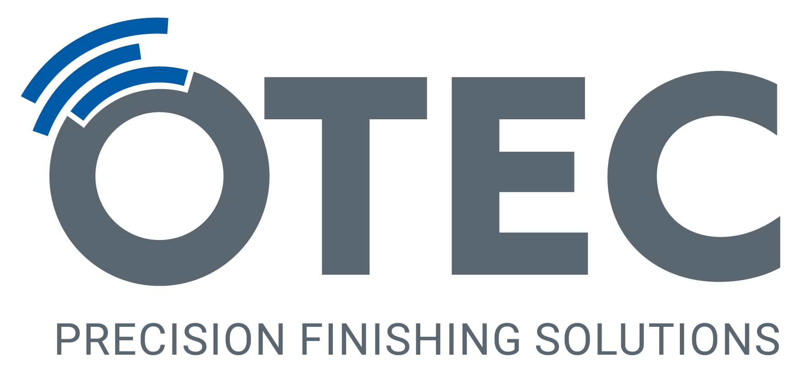

# Python Barcamp
Karlsruhe 2024 <!-- .element: class="bigger" -->

# Allgemeine Hinweise

## Internet
KA-WLAN oder eduroam nutzen

## Räumlichkeiten
A266 - A267

## Zeitplan
|||
|--|--|
|9:15Uhr|Willkommen|
|9:30 Uhr|Sessionplanung|
|10:30 Uhr|Erste Sessions|
|11:30 Uhr|Zweite Sessions|
|12:15 Uhr|Mittagspause|
|||

|||
|--|--|
|13:30 Uhr|Dritte Sessions|
|14:30 Uhr|Sponsored Sessions|
|15:30 Uhr|Kaffeepause|
|16:00 Uhr|Lightning Talks|
|16:30 Uhr|Vierte Sessions|
|17:15 Uhr|Tagesabschluss|
|||

## Freiwilliges Get Together
Restaurant: Kaisergarten reserviert\
Wer möchte kann mit uns um 19:00 Uhr gemeinsam essen gehen. Wir freuen uns Euch weiter kennenzulernen.

### Kaisergarten:
Tram 1 \
Richtung Durlach \
Haltestelle Mühlburger Tor \
oder \
zu Fuß etwa 30 Minuten

Auto \
Parkplätze in südlich-umliegenden Straßen \
Beispielsweise Goethestraße\
(Achtung: sehr rar)\
\
Alternativ \
Parkhaus Magdeburger Haus (2,10€ /45 min)

## Lightning Talks
maximal 5 Minuten

# Sponsoren
\

\
\
\
\
\
\

# Planung der Sessions
|Zeit|A266|A267|
|--|--|--|
|10:30 Uhr|||
|11:30 Uhr|||
|13:30 Uhr|||
|14:30 Uhr|||
|16:30 Uhr|||
||||

# dmTECH
 

# Und Los Geht´s!

# Mittagspause
bis 13:30 Uhr\
findet im Erdgeschoss statt

# Lightning Talks
* Talk1
* Talk2
* Talk3
* ...

# Tagesabschluss

Get Together \
Kaisergarten 19:00 Uhr

Morgen Start 9:00 Uhr

# Danke
\

\
\
\
\
\
\
